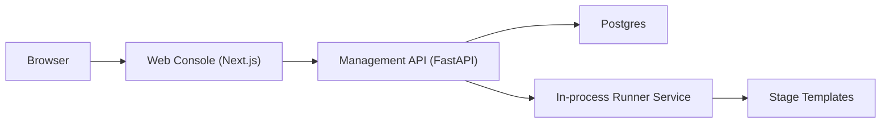

# PipelineForge

PipelineForge is a lightweight data-pipeline control plane with:
- a FastAPI management API (`apps/management_api`)
- a Next.js web console (`apps/web`)
- a Docker-based local stack (`docker-compose.yml`)

This repository now uses one canonical build and run path centered on `make` and root-level Docker Compose.

## Features

- Pipeline catalog and version management (draft, review, publish)
- Run orchestration with status/events/log streaming
- Built-in stage template registry (core, video, dataset)
- Starter pipeline templates seeded on startup
- Role-based access control (admin, pipeline developer, AIOps)

## Architecture



## Quickstart (Docker)

1. Create local env file:

```bash
cp .env.example .env
```

2. Build and start the stack:

```bash
make docker-run
```

3. Open the services:
- Web: <http://localhost:3000>
- API docs: <http://localhost:8000/docs>
- API health: <http://localhost:8000/healthz>

Default local users:
- `admin@pipelineforge.local` / `Admin123!`
- `dev@pipelineforge.local` / `Dev123!`
- `aiops@pipelineforge.local` / `Aiops123!`

## Local Development

### Prerequisites

- Python 3.11+
- Node.js 20+
- Docker + Docker Compose (for container flow)

### Setup

```bash
python3 -m venv .venv-management
.venv-management/bin/pip install --upgrade pip
.venv-management/bin/pip install -r apps/management_api/requirements-dev.txt
npm ci --prefix apps/web
```

### Canonical Make Targets

```bash
make help
make fmt
make lint
make test
make build
make run
make docker-build
make docker-run
make clean
```

### Run API (host)

```bash
make run
```

### Run web dev server (separate terminal)

```bash
cd apps/web && npm run dev
```

## Docker Workflow

### Build images

```bash
make docker-build
```

### Start stack

```bash
make docker-run
```

### Stop stack

```bash
docker compose down
```

## Configuration Reference

Set values in `.env` (copy from `.env.example`).

- `API_IMAGE`: API image tag
- `WEB_IMAGE`: web image tag
- `POSTGRES_DB`: Postgres database name
- `POSTGRES_USER`: Postgres username
- `POSTGRES_PASSWORD`: Postgres password
- `SECRET_KEY`: auth/signing secret
- `SECRET_ENCRYPTION_KEY`: encryption key for sensitive fields
- `FRONTEND_ORIGIN`: CORS origin for web app
- `NEXT_PUBLIC_API_BASE_URL`: web -> API base URL
- `RAY_MODE`: dataset runtime mode (`local` by default)
- `RAY_ADDRESS`: Ray address (`auto` by default)
- `PIPELINEFORGE_DATASET_STORAGE_OPTIONS_JSON`: JSON storage options for dataset IO
- `DEFAULT_ADMIN_EMAIL`, `DEFAULT_ADMIN_PASSWORD`: seeded admin user
- `DEFAULT_DEV_EMAIL`, `DEFAULT_DEV_PASSWORD`: seeded developer user
- `DEFAULT_AIOPS_EMAIL`, `DEFAULT_AIOPS_PASSWORD`: seeded AIOps user

## Troubleshooting

- API fails at startup due DB connection:
  - Ensure Postgres is healthy: `docker compose ps`
  - Confirm DB vars in `.env` match API connection settings.

- Web cannot reach API:
  - Verify `NEXT_PUBLIC_API_BASE_URL` in `.env`
  - Check API health endpoint: `curl http://localhost:8000/healthz`

- Tests fail due missing tools:
  - Recreate env with `apps/management_api/requirements-dev.txt`
  - Reinstall web dependencies with `npm ci --prefix apps/web`

## Migration Notes

- Legacy upstream naming was replaced with `PipelineForge` in user-facing/config surfaces.
- Root `docker-compose.yml` is now the only supported Compose file.
- `Makefile` is the canonical developer entrypoint.
- Legacy deployment scripts and Kubernetes scaffolding were removed in favor of one reproducible local path.
