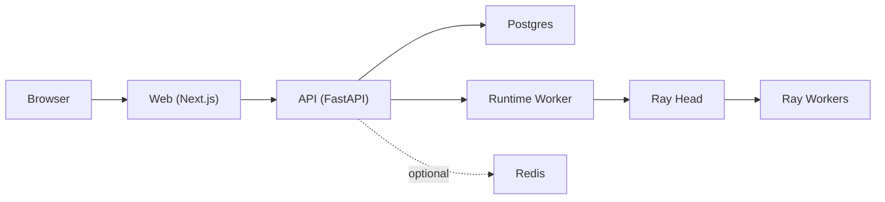

# Deployment Architecture

This repository uses a unified deployment layout under `deployment/`:

- `deployment/docker/`: optimized Dockerfiles for API, Web, Runtime
- `deployment/compose/`: local Docker Compose stack and Ray-local overlay
- `deployment/k8s/`: Kubernetes manifests for Ray and application services
- `deployment/scripts/`: build, run, smoke, and size-check helpers

## Architecture Diagram

## Local Flow (Docker Compose + Ray Local)

1. `deployment/scripts/build.sh` builds `api`, `web`, and `runtime` images.
2. `deployment/scripts/up.sh` starts Postgres, Redis, Ray head/worker, API, Web, and Runtime.
3. API and Runtime connect to Ray via:
   - `RAY_MODE=local`
   - `RAY_ADDRESS=ray://ray-head:10001`
4. `deployment/scripts/smoke.sh` validates:
   - API `/healthz`
   - Web `/`
   - Runtime Ray connectivity (`python deployment/scripts/smoke_test.py --component runtime`)

## Kubernetes Flow

1. `deployment/scripts/k8s-deploy.sh` applies namespace + manifests in `deployment/k8s/`.
2. Ray head + workers are deployed first.
3. API, Web, Runtime use `envFrom` (`ConfigMap` + `Secret`).
4. Runtime uses:
   - `RAY_MODE=k8s`
   - `RAY_ADDRESS=ray://ray-head:10001`
5. `deployment/scripts/k8s-smoke.sh` checks deployment readiness, runtime Ray connectivity, and API/Web endpoints via port-forward.

## Production Guidance

- Push images to a registry and set `API_IMAGE`, `WEB_IMAGE`, `RUNTIME_IMAGE` before K8S deploy.
- Replace `deployment/k8s/app/secret.yaml` defaults with real secrets.
- Keep `ray-worker` replicas and resources aligned with pipeline workload.
- Add persistent volumes for Postgres in production.
- Keep runtime image lean: use pinned runtime deps only, no build tools in final stage.
- Run `deployment/scripts/check-image-size.sh` in CI to prevent regressions.
